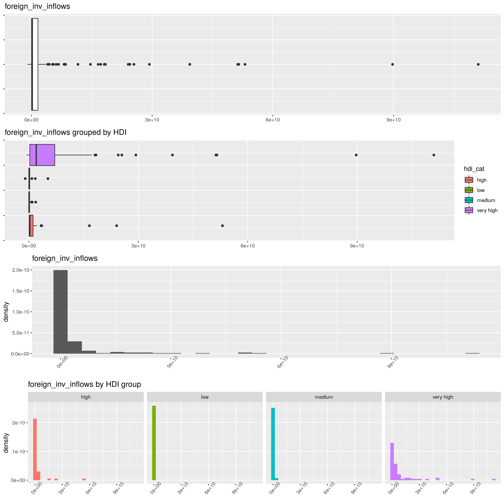

```{r setup, include=FALSE}
knitr::opts_chunk$set(
    echo = TRUE,
    collapse = TRUE,
    comment = '#>',
    fig.path = './figures/'
)
```


```{r, echo=FALSE, warning=FALSE, message=FALSE}
# script with all the content from the EDA
# Importing libraries
library(dplyr)
library(ggplot2)
library(stringr)
library(gridExtra)
library(outliers)
library(PerformanceAnalytics)
library(foreach)

# turn off warnings
options(warn=-1)


# importing the data
df <- read.csv('./data/data.csv')

# function to plot
plots <- function(dataset, col, fw=FALSE, hist='default',
                  density='default' , bins='default',
                  xtick_angles='default', sep=FALSE, savefig='default', filename='./plot.png') {
    var <- dataset %>% dplyr::select(col)
    if (bins == 'default') {bins <- rep(10,2)}
    if (xtick_angles == 'default') {xtick_angles <- rep(90,2)}
    if (hist == 'default') {hist <- c(FALSE,FALSE)}
    if (density == 'default') {density <- c(TRUE,TRUE)}
    if (savefig == 'default') {savefig <- c(FALSE,14,14)}

    p1 <- dataset %>% ggplot(aes(x=var[,1])) +
        geom_boxplot() +
        ggtitle(str_interp("${col}")) +
        theme(axis.title.x=element_blank(),axis.text.y=element_blank())
    p2 <- dataset %>% ggplot(aes(x=var[,1], fill=hdi_cat)) +
        geom_boxplot() +
        ggtitle(str_interp("${col} grouped by HDI")) +
        theme(axis.title.x=element_blank(),axis.text.y=element_blank())
    p3 <- dataset %>% ggplot(aes(x=var[,1])) +
        ggtitle(str_interp("${col}")) +
        theme(axis.title.x=element_blank(),
                axis.text.x = element_text(angle = xtick_angles[1]))
    p4 <- dataset %>% ggplot(aes(x=var[,1])) +
        ggtitle(str_interp("${col} by HDI group")) +
        theme(axis.title.x=element_blank(),
                axis.text.x = element_text(angle = xtick_angles[2]))
    if (hist[1] == TRUE) {
        p3 <- p3 + geom_histogram(aes(y=..density..),bins=bins[1])}
    if (hist[2] == TRUE) {
        p4 <- p4 + geom_histogram(show.legend = FALSE,bins=bins[2],
                                  aes(fill=hdi_cat,y=..density..))}
    if (density[1] == TRUE) {
        p3 <- p3 + geom_density()}
    if (density[2] == TRUE) {
        p4 <- p4 + geom_density(aes(group=hdi_cat,colour=hdi_cat,fill=hdi_cat))}
    if (fw == TRUE) {p4 <- p4 + facet_wrap(~hdi_cat, nrow = 1)}
    if (sep == TRUE) {
        grid.arrange(p1,p2, nrow=2)
        grid.arrange(p3,p4, nrow=2)}
    else {grid.arrange(p1,p2,p3,p4, nrow=4)}
    if (savefig[1] == TRUE) {ggsave(file=filename, width=savefig[2], height=savefig[3],
                                 arrangeGrob(p1,p2,p3,p4, nrow=4))}
}

# Helper function to colour num. variables by cat. variables
colors <- function(cat_var, colors_vector) {
    kleuren <- as.numeric(as.factor(cat_var))
    foreach (i=1:length(kleuren), kleur=kleuren) %do% {
        kleuren[i] = colors_vector[kleur]
    }
    return(kleuren)
}

# setting colnames for variables to use in the analysis
cols = names(df)
cols = cols[6:(length(cols)-2)]

# Selecting colours per HDI
color_1 <- "blueviolet"
color_2 <- "red"
color_3 <- "black"
color_4 <- "green"
palette <- c(color_1,color_2,color_3,color_4)
hdi_colours <- colors(df$hdi_cat,palette)
```

\newpage

# Dataset of choice

For this project I decided to pick a custom-built dataset obtained from the [World bank Databank](https://databank.worldbank.org/home.aspx), specifically the [World Development Indicators database](https://databank.worldbank.org/source/world-development-indicators). This is the "primary World Bank collection of development indicators" as stated on the database description. It has lots of economic, education, energy use, and population specific metrics.

I find demographic data fascinating, and I think this dataset will be quite good for predicting country development measures along with providing quite interesting and relevant information.

## Variables

\large
NOTE:
\normalsize

- **\textcolor{blue}{blue}** = used for training/predicting
- **\textcolor{red}{red}** = target variable
- **\textcolor{green}{green}** = ID variables
- **\textcolor{violet}{purple}** = variables excluded as either they were _components_ of HDI or they were 100% correlated to another variable (like GNI/GDP, which are both 100% correlated and GNI is a component of HDI)

Variables in the original dataset as constructed using the World Bank Databank tool (variables were renamed):

- [**year**]{color="green"}: year the data was obtained in
- [**year_code**]{color="green"}: code for the year as the world bank databank sets it
- [**country_name**]{color="green"}: name of the country
- [**country_code**]{color="green"}: alpha-3 ISO 3166 code for the country
- [**foreign_inv_inflows**]{color="blue"}: Foreign direct investment, net inflows (BoP, current US$)
- [**exports_perc_gdp**]{color="blue"}: Exports of goods and services (as a % of GDP)
- [**inflation_perc**]{color="blue"}: Inflation, consumer prices (annual %)
- [**education_years**]{color="blue"}: Compulsory education, duration (years)
- [**education_perc_gdp**]{color="blue"}: Government expenditure on education, total (as a % of GDP)
- [**gds_perc_gdp**]{color="blue"}: Gross domestic savings (as a % of GDP)
- [**gross_savings_perc_gdp**]{color="blue"}: Gross savings (as a % of GDP)
- [**int_tourism_arrivals**]{color="blue"}: International tourism, number of arrivals
- [**int_tourism_receipts**]{color="blue"}: International tourism, receipts (in current US$)
- [**perc_internet_users**]{color="blue"}: Individuals using the Internet (as a % of population)
- [**access_to_electricity**]{color="blue"}: Access to electricity (% of population)
- [**agricultural_land**]{color="blue"}: Agricultural land (% of land area)
- [**birth_rate**]{color="blue"}: Birth rate, crude (per 1,000 people)
- [**gne**]{color="blue"}: Gross national expenditure (% of GDP)
- [**mobile_subscriptions**]{color="blue"}: Mobile cellular subscriptions (per 100 people)
- [**infant_mort_rate**]{color="blue"}: Mortality rate, infant (per 1,000 live births)
- [**sex_ratio**]{color="blue"}: Sex ratio at birth (male births per female births)
- [**greenhouse_gas_em**]{color="blue"}: Total greenhouse gas emissions (kt of CO2 equivalent)
- [**urban_pop_perc**]{color="blue"}: Urban population (% of total population)
- [**hdi**]{color="red"}: human development index 
- [**hdi_cat**]{color="red"}: Human development index as a category
- [**life_exp**]{color="violet"}: Life expectancy at birth, total (years)
- [**gdp**]{color="violet"}: GDP (current US$) 
- [**gni**]{color="violet"}: GNI (current US$)
- [**fertility_rate**]{color="violet"}: Fertility rate, total (births per woman)

\newpage

### The target variable

As all these variables could perhaps tell us how developed a country is, we used a constructed categorized Human development index variable in order to classify the countries using the above variables (unless stated otherwise by their colour) as training variables.

The criteria for constructing the categorical variable *hdi_cat* was the following:

  \begin{itemize}
    \item Very high: HDI above 0.8
    \item High: HDI between 0.7 and 0.799
    \item Medium: HDI between 0.55 and 0.699
    \item Low: HDI under 0.55
  \end{itemize}

This categorization is emulated from Wikipedia's construction and uses the same ranges as used in every Wikipedia article referencing HDI.

# Data preprocessing

The data cleanup and preliminary feature engineering was done in Python and the imputation was then done in R within the same Jupyter Notebook (called *preprocessing.ipynb*).

## Methodology and steps

\begin{enumerate}
  \item Prior to importing there was a search within the .csv file with the following regex: \begin{verbatim} \s\[[\w\S]{1,}\] \end{verbatim} as a find and replace and removing every instance of it. This regex matches a metadata tag that the world bank uses in their dataset. Following this step, the data was imported.

  \item Metadata at the end of the dataset was removed, the dataset was filtered excluding these region codes (the codes were excluded as they were country aggregates, and we're only interested in the countries themselves).

  \item The year column was converted to integer and the '..' values (which represent NAs in the World bank databank) were replaced for numpy NaNs and then the values were sorted by year and country name.

  \item Data missing in later years (2020, 2019) was backfilled with data from previous years, as it still fits our modelling purposes. The data that goes the furthest back is from ~18 years prior, so 2002.

  \item Columns with more than 45 NA values were removed as this represents roughly 25% of the countries in question.

  \item The life expectancy, GDP, GNI and fertility rate columns were removed as these are either components of HDI or (in the case of fertility rate) are 100% correlated with other elements in our dataset (crude birth rate in this particular case).

  \item We scrape Wikipedia in order to obtain an updated metric on HDI estimates for each country. We also scrape it to obtain the alpha-3 3166 codes for each country. The data was obtained with the purpose of making it easier to join with the dataset obtained from the World Bank, as joining by country names is not reliable enough (misses ~20 countries which the alpha-3 codes do not).

  \item We add HDI to the main dataframe

  \item Numerical columns were converted into floats and column names were simplified for easier future manipulation.

  \item The categorical target variable is constructed as explained previously in this step.

  \item The data is then exported as a csv, along with a json file that shows how the columns were renamed

  \item The data is then imported in an R cell and a MICE imputation is performed using the 'cart' method with m = 5 in order to impute the very few missing values remaining.
\end{enumerate}

\newpage

# Exploratory Data Analysis

## Looking at variables by themselves

The plots of choice for visually analyzing the variables prior to any processing has been Boxplots and Histograms/density plots all looked at individually and categorized by *hdi_cat* which is our categorical target variable (HDI).

Given the space constraints of this report, if a plot for a specific variable is not shown here but talked about or mentioned, it will be shown in the *eda.ipynb* and *eda.html* notebook and notebook export used to perform the visual analysis.

### Significantly right-skewed variables

```{r, echo=FALSE, warning=FALSE, message=FALSE, fig.show='hide', results='hide', fig.height=14, fig.width=12}
plots(dataset=df, col=cols[1], hist=c(TRUE,TRUE), density=c(FALSE,FALSE), xtick_angles=c(50,50) ,bins=c(30,30), fw=TRUE, sep=FALSE, savefig=c(TRUE,12,12), filename='./img/foreign_inv_inflows.png')
```

{width=60%}


The following variables showed a similarly right-skewed shape with significant outliers:

  - **foreign_inv_inflows**: Heavily right skewed, significant outliers (USA, UK, Germany, China...) etc... Given the histogram of *foreign_inv_inflows* when grouped by very high HDI vs low HDI, it would seem like the more developed a country is, the more foreign investment it should have. The grouped boxplot also shows the same trend.
  - **int_tourism_receipts** and **int_tourism_arrivals**: Basically the same as with *foreign_inv_inflows*, we see that there's a significant tendency for higher development nations to receive significantly more tourism receipts and arrivals.
  - **greenhouse_gas_em**: Just like with the previous two variables, fossil fuel use, meat production and economic activities like such produce huge amounts of greenhouse gases, and the more developed a country is, the more emissions it produces. However, this one is a bit less strongly inclined like the previous two. We can clearly see that there's many less developed countries with a high level of emissions. A notorious example of this is China, which is the 2nd country with the most emissions and falls under the high category of HDI, by far exceeding the emission levels of most countries with very high HDI countries.

### Education variables

{width=60%}

  - **education_years**: There's a clear tendency, both shown by our grouped boxplots and grouped density plots, for very high HDI countries to have significantly longer periods compulsory education, with few exceptions in each group, however a clear tendency that peaks between 8 and 12 years of education for both high and very high HDI countries. Low and medium HDI countries could be clumped together with similar compulsory education times, but with more variability for medium HDI countries.
  - **education_perc_gdp**: How much are countries spending on education as a percentage of their GDP is a very interesting variable, as we can see that the consistency for higher and lower spendings respectively for low and very high HDI countries is quite solid, while medium HDI countries show an incredible variability versus other groups. High HDI countries show significant variability versus that of very high and low HDI countries, however, still aligning more iwth very high HDI countries than the rest.

### Other economic variables

These variables might have some skewness towards more tails or longer tails than a normally distributed variable should have. Therefore they're hard to classify as particularly right or left skewed.

  - **exports_perc_gdp**: This variable has a long left tail and it is right-skewed. We can see the box for medium developed countries is larger than others while very high and high HDI countries tend to have higher export amounts as percentage of GDP. Low HDI countries lag behind, as expected. It is interesting to see how medium HDI countries completely bridge the gaps between high, very high and low HDI countries in terms of exports, in the sense that there's plenty of countries with medium HDI with exports just as high as others with significantly higher HDIs.
  - **inflation_perc**: For inflation we can see that independently of the HDI of a country, inflation could, perhaps, be an inevitable event of economic/political management or mismanagement and uncertainty. Either way, we can clearly see that the higher the HDI, the less uncertain such inflation rate will be. The boxes for medium and low HDI countries are significantly larger than very high and high therefore telling us that there's less consistency and high inflation events, while universal, are unpredictable, but less unpredictable and probably less common the higher the HDI of a country is.
  - **gds_perc_gdp**: For gross domestic savings we can see that there's a clear difference between groups, with much more overlapping on the high end of HDI than the medium to low end of HDI. However, clearly, once again, the higher the HDI the higher the GDS. Much more variability again on those middle HDI groups (high and medium).
  - **gross_savings_perc_gdp**: Gross savings as a percentage of GDP is an interesting variable, where the only defining feature of high and very high HDI countries being, again, relative consistency versus other groups, there might be seemingly no predictive capability in it due to the extremely lo variability of the values among groupsm however, it definitely differentiates very high and low HDI countries quite well. 

### Other interesting variables

These variables seemed like quite appropriate to me for predicting HDI or any other development measure, as they could potentially be huge differentiators between the different HDI groups.

 - **perc_internet_users**: The percentage of internet users in each group is a surprisingly good differentiator as mentioned previously. We can see that, sure there's countries in each group with percentages that resemble other groups, but the difference in variability among groups is massive. Where the consistency of low HDI countries vs very high and high HDI countries is *hugely* different. We can see the standard deviations (and means) per group follow an interesting ladder: the $sigma_{low} \approx 0.714$, $sigma_{medium} \approx 2.532$, $sigma_{high} \approx 4.908$, $sigma_{very high} \approx 20.382$.